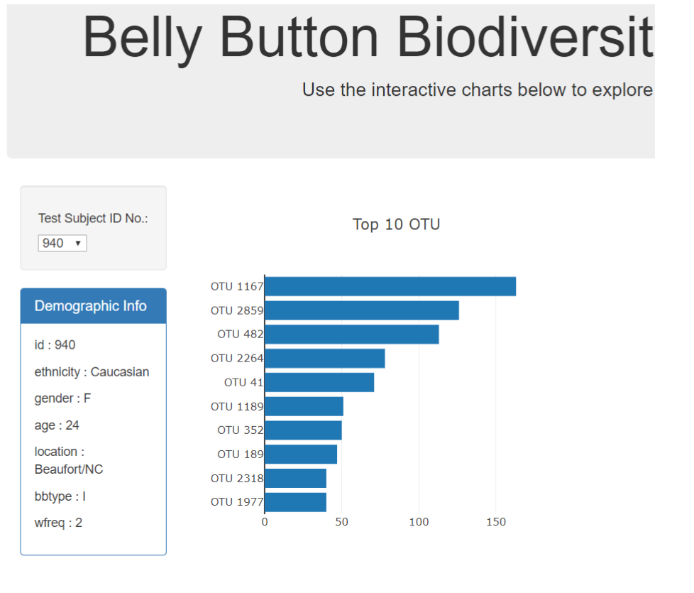

# Project 2 - Breweries by State
## TEAM
_Amanda Belloma_, 
_Dallas Diaz_, 
_Jamie Lewis_, 
_Tim Raynor_

# **TOPIC**
Compare different values by state to the number of breweries

# **DATA SOURCES**

## UNITED STATES INCOME BY STATE
Income by state data was sourced from the United States Census Bureau.  Data includes median household income by state from 1984 to 2018.  Standard deviations are included as well. 						
[Link Here](https://www2.census.gov/programs-surveys/cps/tables/time-series/historical-income-households)

## WINERIES
Data related to the number of wineries in the United States was obtained from wine-road.com (source data attributed to The National Association of American Wineries). Data includes the number of wineries grouped by state.  
[Link Here](http://www.wine-road.com/education/articles/state-winery-rankings.php)

## BREWERIES
Data related to the number of breweries in the United States was obtained kaggle.com.  Data includes brewery name, type, address, website, state, total breweries in state.
[Link Here](https://www.kaggle.com/brkurzawa/us-breweries)

Found a more comprehensive list https://www.brewersassociation.org/directories/breweries/ & https://en.wikipedia.org/wiki/List_of_breweries_in_the_United_States

## POPULATION BY STATE
Population by state for several years, using 2018 as the most current to match the income by state from the United States Census Bureau.
[Link Here](https://www.census.gov/newsroom/press-kits/2018/pop-estimates-national-state.html)

## STATE BOARDERS GEOJSON
https://eric.clst.org/tech/usgeojson/

# DATA WRANGLING
1. Dropped columns not used
2. Renamed columns
4. Uppercase state columns to allow for better matching
5. Searched data frames to validate data could be pulled
6. Consolidated data using using groupby function
7. Web scraping for full list of breweries

## INSPIRATION FROM PREVIOUS HOMEWORKS
1. Some drop downs or options to select views like Web Design

2. A drop down to select a state and list facts like the web design homework

3. An interactive chart comparing several values to the number of breweries like D3 homework

4. Chorolpleth map

4. Found this link with wavy circle gauges - http://bl.ocks.org/brattonc/5e5ce9beee483220e2f6
